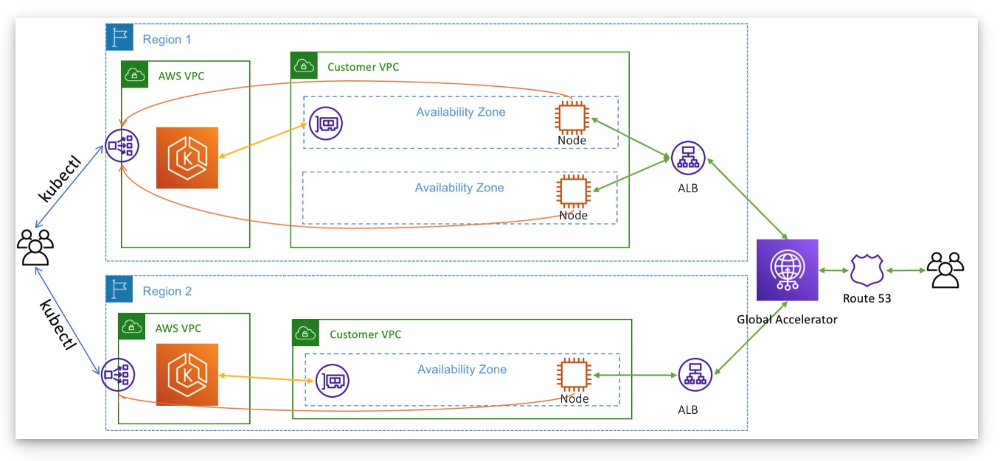

# eks-terraform
Building EKS cluster with Terraform

# Things to Explore - 
### Amazon EKS Anywhere - 
- https://aws.amazon.com/blogs/containers/introducing-amazon-eks-anywhere/
- Enterprise Subscription.

### What is Amazon EKS Pod Identity Agent?

### What is the appoach if we want to use EKS in multiple regions? 

Single Control Plane (replicated) across multiple regions with Node Groups in multiple regions is not supported by the EKS as of today.
Few scenarios to support Active-Active and Active-Failover cases across regions we can build identical EKS Clusters in two regions and front with Global Accelerator. Even AWS recommends the same approach.

My take on Multi-region EKS is - 
1. Architecture design should be as simple as possible
2. Create 2 VPCs in 2 Regions
3. Create 2 EKS Cluster with Node Groups in two regions
4. Enable VPC Peering between two regions provided if required only
5. Deploy AWS Load Balancer Controller in both EKS Clusters from two regions
6. Front your Ingress Services with Global Accelerator for Geo load balancing (Active-Active or Active-Standby)

Please refer to the links below.
1. https://disaster-recovery.workshop.aws/en/services/containers/eks/eks-cluster-multi-region.html
2. https://aws.amazon.com/blogs/containers/operating-a-multi-regional-stateless-application-using-amazon-eks/

Additional Reference
1. https://devops.pingidentity.com/deployment/deployK8s-AWS/
2. https://blogs.mulesoft.com/dev-guides/how-to-tutorials/multi-region-deployments-on-eks/
3. https://catalog.us-east-1.prod.workshops.aws/workshops/c15012ac-d05d-46b1-8a4a-205e7c9d93c9/en-US/40-deploy-clusters

Some more references -
1. https://aws.amazon.com/blogs/containers/eks-regional-clusters/
2. https://aws.amazon.com/blogs/containers/operating-a-multi-regional-stateless-application-using-amazon-eks/
3. https://aws.amazon.com/blogs/containers/eks-cluster-autoscaler-supports-multi-region-clusters/
4. https://aws.amazon.com/blogs/containers/eks-multi-region-clusters-now-generally-available/

